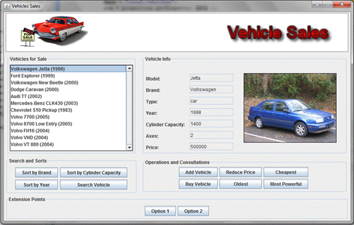

# Problem Description

It is wanted to build an application for a used vehicles sales business, which
offers cars, buses, motorbikes and trucks. In addition of the type of each vehicle,
it is also known the brand, the model, the year, number of axes, cylinder
capacity, price and a picture of it. Because of business rules, there are not two
vehicles with the same model and year.

The application must permit the user the following operations: (1) Get the list of
all the vehicles that are on sale, (2) get the detail information of a given
vehicle, (3) add a new vehicle to the sale, (4) sort the vehicle list by model,
brand or year. (5) search a vehicle using the model and the year, (6) buy a vehicle
(remove it from the vehicles sales list), (7) decrease in 10% the price of the
vehicles that have a higher price than the given, (8) find the oldest vehicle,
(9) find the most powerful vehicle (with more cylinder capacity), and (10) find
the cheaper vehicle.

## Graphical User Interface

The list of available vehicles appears in the upper left side. Whit the buttons
that are under the list, the user can sort the list by brand, cylinder capacity
and year. It can also search a vehicle, given its model and year. In the right
side, the information of the vehicle that is selected appears. There is all the
information about the vehicle. Hit the buttons that are in the panel ?Operations
and Consultations, the user can add a new vehicle, find the cheapest vehicles,
the oldest or the most powerful, also decrease the price of the vehicles which
price is higher than the given. There is a button that allows the user to buy
the vehicle that is being shown, removing it from the list. 